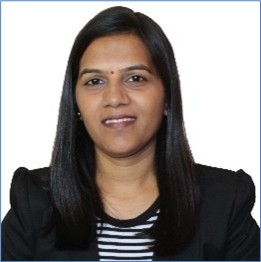

---
---

# Kirti Manik Paygude

**Contact**

- **Phone:** +91 9403983983, +91 9403982982
- **Email:** kmpaygude@gmail.com
- **LinkedIn:** https://www.linkedin.com/in/kirti-paygude-37bb5a8b
- **Location:** Pune, Maharashtra, India (411046)

## PROFESSIONAL SUMMARY / PROFESSIONELT OPSUMMERING

Embedded Software Engineer with 12+ years of experience in embedded systems, developing high-quality firmware and control software for industrial and mobile equipment. Skilled in text-based and graphical software programming, with a proven track record of delivering full software lifecycle projects including specification, design, verification, release, and maintenance. Experienced in debugging hardware/software interfaces, writing and maintaining technical documentation, and defining structured test strategies. Passionate about continuous improvement and advancing sustainable technologies through agile development and cross-functional collaboration.

## Way of Working

- Comfortable working independently or in team with transparency and clear responsibility
- Experience working in flat organizations with shared ownership
- Values structured approach leading to predictable delivery
- Values early technical correctness and robustness, enabling predictable delivery and gradual time-to-market improvements without compromising product quality
- Values automation of repeatable processes to ensure consistency, reduce manual effort, and support sustainable delivery
- Passionate to learn new technologies

## Key Skills

- **Programming:** Assembly, C/C++, Python, LabVIEW, VB
- **Protocols:** TCP/IP, UART, SPI, I2C, CAN (J1939)
- **Tools & Platforms:** PLUS+1 GUIDE, Azure DevOps, Polarion, ROS, Git, SVN, REST APIs, Jira
- **Testing & Debugging:** Oscilloscope, LabVIEW, REST APIs
- **Methodologies:** Agile/Scrum, CI/CD, Functional Safety, DFMEA

## Certifications & Training

- MATLAB Onramp — Dec 2021
- Simulink Onramp — Dec 2021
- LabVIEW Core 1 & 2 — Mar 2019
- Functional Safety Engineer (IEC61508:2010) — Jun 2022
- Certified Scrum Product Owner — Jul 2025

## Languages

- English — Fluent
- Danish — Beginner
- Marathi — Native
- Hindi — Native

## Professional Experience

### Danfoss Power Solutions
**Sr. Software Engineer | Danfoss Power Solutions Pvt. Ltd., Pune, India | May 2021 – Sep 2023**

**Danfoss Power Solutions ApS, Nordborg, Denmark (Assignment) | Oct 2023 – Sep 2025**

**Danfoss Power Solutions Pvt. Ltd., Pune, India | Oct 2025 – Feb 2026**

Responsibilities & achievements:
- Developed and released middleware for an Autonomous Control Library and compliance libraries, including LiDAR drivers for off‑highway machines (C, PLUS+1 GUIDE) on embedded Linux.
- Defined and executed unit, integration, and system test strategies to ensure reliability.
- Implemented CI/CD automation with Azure Pipelines to reduce deployment time and improve code quality.
- Contributed to standards, guidelines, and cross‑cultural process improvements.

**Tools:** C/C++, Python, PLUS+1 GUIDE, ROS (Ubuntu), TortoiseSVN, Azure Git, Polarion

### Sphinx Worldbiz Ltd. (Contract to Knorr‑Bremse Technology Center India)
**Sr. Software Engineer | Oct 2019 – May 2021**

Responsibilities:
- Built automated test tools for rail electronics systems and designed LabVIEW OOP modules.
- Integrated REST APIs for dynamic code generation and streamlined version control workflows.

**Tools:** LabVIEW 2018, TortoiseSVN, JIRA

### HUSCO Hydraulics Pvt. Ltd.
**Sr. Engineer — Embedded Software | Apr 2019 – Oct 2019**

**Embedded Software Engineer | Jan 2016 – Mar 2019**

Contributions:
- Worked on load sensor development from component selection through production and certification.
- Developed embedded software to control hydraulic valves and implemented automated sensor calibration.

**Tools:** IAR Embedded Workbench (AVR32), Serena PVCS & Tracker, Android Studio, Embedded C, CAN J1939, Vector CANalyzer

### Propix Technologies Pvt. Ltd.
**LabVIEW Developer | Apr 2015 – Jan 2016**

**Assistant LabVIEW Developer | Mar 2014 – Mar 2015**

Contributions:
- Trained support engineers and developed product documentation and test plans.
- Developed industrial automation products in embedded C and LabVIEW for inspection systems.

**Tools:** Keil uV3/uV4, NI LabVIEW, NI Vision Development Module

### Magnaflux Systems Pvt. Ltd.
**R&D Engineer | Jun 2012 – Oct 2013**

Contributions:
- Developed simulation/test software in NI LabVIEW and embedded assembly for UPS control systems.

**Tools:** Oscilloscope, Function Generator, MPLAB, NI LabVIEW

## Education

- Bachelor of Engineering (Electronics & Telecommunication), Savitribai Phule Pune University — Higher Second Class

## Projects

Below are a few highlighted projects. Click a project to see more details.

- [Autonomous Control Library](projects/autonomous-control-library.md) — Middleware and LiDAR drivers for autonomous off‑highway machines.
- [Automated Test Tools for Rail Electronics](projects/automated-test-tools.md) — LabVIEW-based automated test frameworks.
- [Load Sensor Development](projects/load-sensor-development.md) — Sensor firmware, calibration, and production support.
- [Industrial Automation & Inspection Systems](projects/industrial-automation.md) — Inspection product development using LabVIEW and embedded C.
- [UPS Control & Monitoring](projects/ups-control-monitoring.md) — Embedded firmware and simulation tools for UPS systems.
